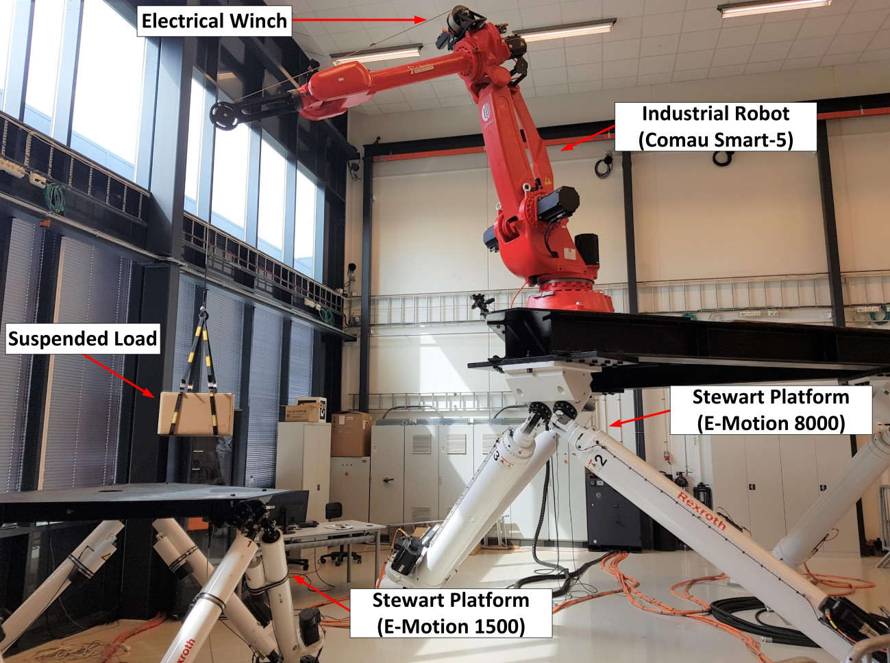

# Simulink-Simulator

This repo includes the MATLAB-Simulink Simulator of the Norwegian Motion Laboratory (UiA Motion Lab) including the equipment shown in the figure below.

The Simulator is work in progress and is developed using MATLAB R2024a using Simulink, Simscape Multibody, and MATLAB Apps.

To start the Simulator open Main.m and click Play. 
